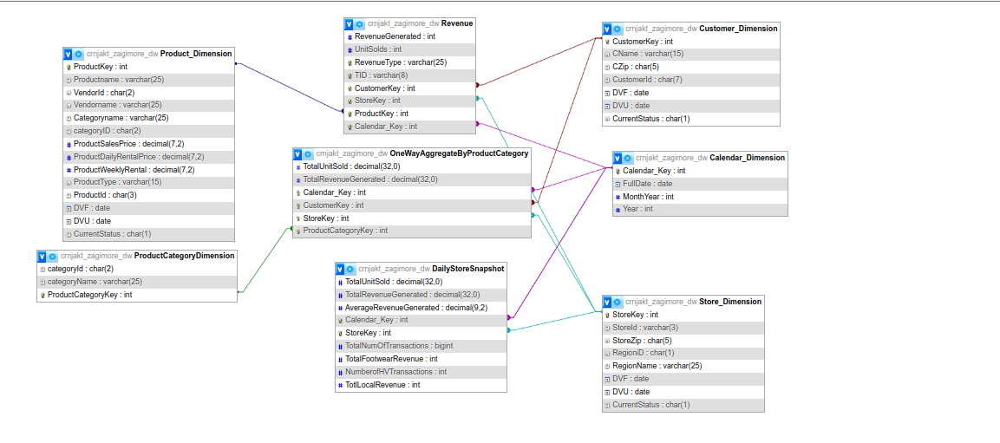

# Data Warehouse ETL Project

This repository demonstrates a complete ETL (Extract, Transform, Load) workflow using SQL DDL scripts and Python orchestration code. It moves data from an operational schema into a staging area and finally into a structured data warehouse.

---

## :file_folder: File Structure

- **`zagimore.ddl`**  
  Defines the operational schema (e.g., `vendor`, `product`, `customer`, `store`) for raw data ingestion.

- **`staging_full.ddl`**  
  Sets up the staging environment tables in which raw data is cleansed and pre-processed before loading into the warehouse.

- **`snapshotsaggregates.ddl`**  
  Builds snapshot and aggregate tables (e.g., `productCategoryDimension`) for summarizing data across time.

- **`procedures.ddl`**  
  Contains stored procedures (e.g., `DailyStoreRefresh`) to automate incremental updates of dimension and fact tables.

- **`etlcode.ddl`**  
  Implements the extract step, creating an `IntermediateFactTable` to consolidate sales metrics from the operational schema.

- **`warehouse_creation.ddl`**  
  Creates the final data warehouse schema, including dimension tables (`Customer_Dimension`, `Store_Dimension`, `Calendar_Dimension`, etc.) and fact tables (`Revenue`, `UnitsSold`).

- **`sliteapproach.py`**  
  Python script using `sqlite3` to orchestrate the ETL process: executes DDL scripts, populates the calendar dimension in Python, and loads staging and warehouse databases.

- **`pymyapproach.py`**  
  Python script using `pymysql` for MySQL: automates database creation, executes DDL files, handles calendar population (via SQL or Python fallback), and refreshes staging and warehouse schemas.

---

## :rocket: Getting Started

### Prerequisites

- **Python 3.x**  
- **SQLite3** or **MySQL** server  
- If using MySQL, install dependencies:  
  ```bash
  pip install pymysql
  ```

### Running the ETL (SQLite)

1. Ensure you have Python 3 and `sqlite3` available.  
2. From the project root:
   ```bash
   python sliteapproach.py
   ```
3. This will create three databases:
   - `crnjakt_zagimore.db` (operational)
   - `crnjakt_datastaging_zagimore.db` (staging)
   - `crnjakt_warehouse_zagimore.db` (data warehouse)

### Running the ETL (MySQL)

1. Update your MySQL credentials in `pymyapproach.py` under the `db_config` dictionary.  
2. Run:
   ```bash
   python pymyapproach.py
   ```
3. The script will create and populate the corresponding MySQL databases:
   - `crnjakt_zagimore`
   - `crnjakt_datastaging_zagimore`
   - `crnjakt_warehouse_zagimore`

### Manual SQL Execution

If you prefer manual control, execute the DDL scripts in the following order against your database server:

```bash
-- 1. Operational schema
psql -f zagimore.ddl

-- 2. Staging schema
psql -f staging_full.ddl
psql -f snapshotsaggregates.ddl
psql -f procedures.ddl

-- 3. ETL extract
psql -f etlcode.ddl

-- 4. Warehouse schema
psql -f warehouse_creation.ddl
```

*(Replace `psql` with `mysql` or your client of choice.)*

---

- **ETL Pipeline Diagram** 
High-level overview of data flow from operational schema → staging → warehouse.


## :building_construction: Operational Schema


--

## :rocket: Staging Schema


---

## :warehouse: Warehouse Schema



---


---

## :handshake: Contributing

Contributions, issues, and feature requests are welcome! Feel free to open a pull request.
